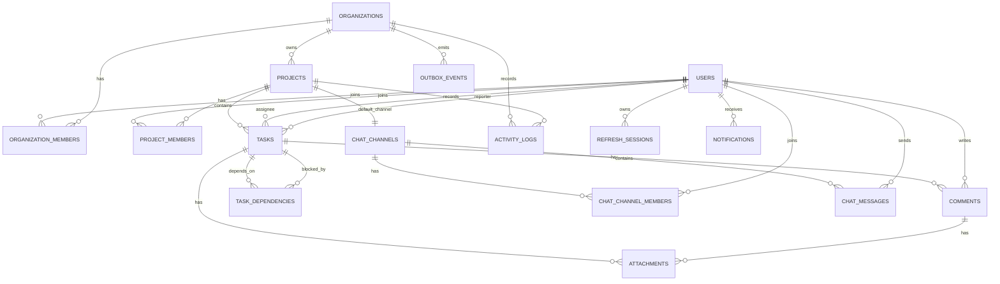
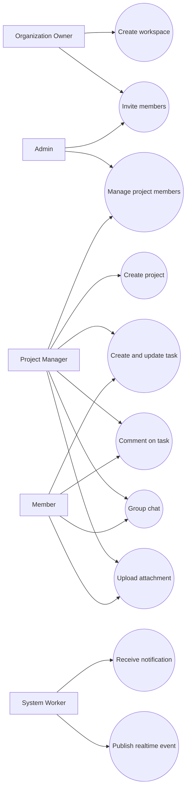
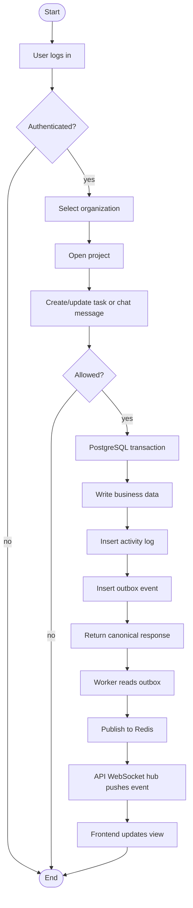
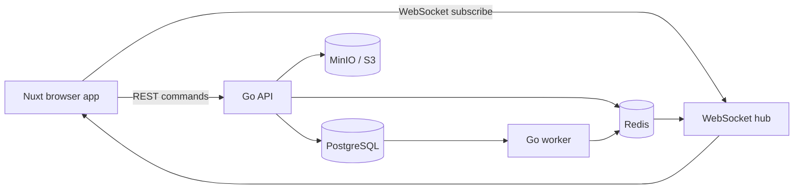

# Database Structure and System Blueprint

This document is the main technical blueprint for persistence, Redis usage, and the system flow around the database layer.

## Short answer

- You do not need to install PostgreSQL, Redis, or MinIO globally on your machine if you use Docker Compose.
- For development, Docker runs those services for you.
- You still need monitoring tools or consoles if you want visibility into them.
- The backend Go service remains the application brain; Nuxt is only the UI and SSR layer.

## Scope

This blueprint covers:

- PostgreSQL as the source of truth
- Redis as cache, pub/sub, queue, and ephemeral coordination
- attachments through S3-compatible storage
- realtime event propagation
- core entity relationships
- ERD, use case, activity, system flow, and system design diagrams

## Data principles

- PostgreSQL stores durable business data.
- Redis never stores the canonical truth.
- Every tenant-owned record must be scoped by `organization_id` where practical.
- UUID or UUIDv7 identifiers are preferred.
- Important tables need `created_at`, `updated_at`, and where relevant `deleted_at`.
- Foreign keys, unique constraints, and indexed lookup columns are required from the start.
- Write operations must be transactional.
- Realtime updates should be based on committed database state, not on frontend optimism alone.

## Database boundary

### PostgreSQL owns

- users
- organizations
- memberships
- projects
- tasks
- dependencies
- comments
- chat messages
- attachments metadata
- notifications
- activity logs
- refresh sessions
- outbox events

### Redis owns

- cache entries
- pub/sub delivery
- job queue state
- short-lived locks
- rate limiting counters
- presence or typing indicators if needed later

### Object storage owns

- file bytes
- previews
- exports
- attachments

## PostgreSQL schema blueprint

### `users`

Main account table.

Key columns:

- `id`
- `email`
- `password_hash`
- `full_name`
- `avatar_url`
- `status`
- `created_at`
- `updated_at`
- `deleted_at`

Indexes and constraints:

- unique `email`
- index `status`
- index `deleted_at`

### `organizations`

Tenant workspace.

Key columns:

- `id`
- `name`
- `slug`
- `owner_user_id`
- `plan`
- `status`
- `created_at`
- `updated_at`
- `deleted_at`

Indexes and constraints:

- unique `slug`
- index `owner_user_id`

### `organization_members`

Membership and role mapping.

Key columns:

- `id`
- `organization_id`
- `user_id`
- `role`
- `joined_at`
- `created_at`
- `updated_at`

Indexes and constraints:

- unique `(organization_id, user_id)`
- index `(user_id, organization_id)`
- index `role`

### `projects`

Project container inside an organization.

Key columns:

- `id`
- `organization_id`
- `name`
- `slug`
- `description`
- `status`
- `created_by`
- `created_at`
- `updated_at`
- `deleted_at`

Indexes and constraints:

- unique `(organization_id, slug)`
- index `(organization_id, status)`

### `project_members`

Project-level access.

Key columns:

- `id`
- `project_id`
- `user_id`
- `role`
- `created_at`

Indexes and constraints:

- unique `(project_id, user_id)`
- index `(user_id, project_id)`

### `tasks`

Core work item.

Key columns:

- `id`
- `organization_id`
- `project_id`
- `task_key`
- `title`
- `description`
- `status`
- `priority`
- `assignee_id`
- `reporter_id`
- `start_date`
- `due_date`
- `position`
- `created_at`
- `updated_at`
- `deleted_at`

Indexes and constraints:

- unique `(project_id, task_key)`
- index `(organization_id, project_id)`
- index `(project_id, status)`
- index `(project_id, assignee_id)`
- index `(due_date)`
- index `(deleted_at)`

### `task_dependencies`

Task relationship graph.

Key columns:

- `id`
- `task_id`
- `depends_on_task_id`
- `created_at`

Indexes and constraints:

- unique `(task_id, depends_on_task_id)`
- index `(depends_on_task_id)`
- prevent self-reference
- prevent cycle by application rule and validation

### `comments`

Comments attached to tasks, project items, or future entities.

Key columns:

- `id`
- `organization_id`
- `project_id`
- `task_id`
- `user_id`
- `body`
- `edited_at`
- `created_at`
- `updated_at`
- `deleted_at`

Indexes and constraints:

- index `(task_id, created_at)`
- index `(project_id, created_at)`
- index `(organization_id, created_at)`

### `chat_channels`

One default channel per project for group chat.

Key columns:

- `id`
- `organization_id`
- `project_id`
- `type`
- `name`
- `created_at`

Indexes and constraints:

- unique `project_id` for default project channel
- index `(organization_id, project_id)`

### `chat_channel_members`

Project chat access list.

Key columns:

- `id`
- `channel_id`
- `user_id`
- `joined_at`
- `created_at`

Indexes and constraints:

- unique `(channel_id, user_id)`
- index `(user_id, channel_id)`

### `chat_messages`

Persisted chat history.

Key columns:

- `id`
- `channel_id`
- `organization_id`
- `project_id`
- `user_id`
- `message`
- `message_type`
- `reply_to_message_id`
- `created_at`
- `updated_at`
- `deleted_at`

Indexes and constraints:

- index `(channel_id, created_at)`
- index `(project_id, created_at)`
- index `(organization_id, created_at)`

### `attachments`

Metadata for files stored in MinIO or S3.

Key columns:

- `id`
- `organization_id`
- `project_id`
- `task_id`
- `comment_id`
- `uploaded_by`
- `storage_provider`
- `storage_key`
- `original_name`
- `mime_type`
- `size_bytes`
- `checksum`
- `created_at`

Indexes and constraints:

- unique `storage_key`
- index `(project_id, created_at)`
- index `(task_id, created_at)`

### `notifications`

User-facing notification inbox.

Key columns:

- `id`
- `organization_id`
- `user_id`
- `type`
- `title`
- `body`
- `entity_type`
- `entity_id`
- `is_read`
- `read_at`
- `created_at`

Indexes and constraints:

- index `(user_id, is_read, created_at)`
- index `(organization_id, created_at)`

### `activity_logs`

Audit trail for visible actions.

Key columns:

- `id`
- `organization_id`
- `project_id`
- `actor_user_id`
- `entity_type`
- `entity_id`
- `action_type`
- `before_json`
- `after_json`
- `created_at`

Indexes and constraints:

- index `(organization_id, created_at)`
- index `(project_id, created_at)`
- index `(entity_type, entity_id)`

### `refresh_sessions`

Refresh-token session store.

Key columns:

- `id`
- `user_id`
- `session_token_hash`
- `device_name`
- `ip_address`
- `user_agent`
- `expires_at`
- `revoked_at`
- `created_at`

Indexes and constraints:

- unique `session_token_hash`
- index `(user_id, expires_at)`

### `outbox_events`

Durable queue for reliable event publication.

Key columns:

- `id`
- `organization_id`
- `project_id`
- `event_type`
- `aggregate_type`
- `aggregate_id`
- `payload_json`
- `status`
- `attempt_count`
- `available_at`
- `processed_at`
- `created_at`

Indexes and constraints:

- index `(status, available_at)`
- index `(organization_id, created_at)`
- index `(aggregate_type, aggregate_id)`

## Optional future tables

These are not required on day one, but they may appear later:

- `project_labels`
- `task_labels`
- `task_watchers`
- `saved_filters`
- `notification_preferences`
- `audit_login_events`
- `team_templates`

## Relationship map

```text
users
  -> organization_members
  -> project_members
  -> tasks (assignee/reporter)
  -> comments
  -> chat_messages
  -> notifications
  -> refresh_sessions

organizations
  -> projects
  -> organization_members
  -> tasks
  -> comments
  -> chat_channels
  -> attachments
  -> activity_logs
  -> notifications
  -> outbox_events

projects
  -> project_members
  -> tasks
  -> chat_channels
  -> comments
  -> attachments
  -> activity_logs

tasks
  -> comments
  -> attachments
  -> task_dependencies

chat_channels
  -> chat_channel_members
  -> chat_messages
```

## Redis blueprint

Redis is used for speed and coordination, not durability.

### Main Redis use cases

- cache for expensive read queries
- pub/sub fan-out for realtime delivery
- worker queue for deferred jobs
- distributed locks for rare critical sections
- rate limiting
- temporary presence and typing state

### Recommended key groups

- `cache:org:{org_id}:projects:list`
- `cache:project:{project_id}:board`
- `cache:task:{task_id}`
- `presence:project:{project_id}:users`
- `typing:channel:{channel_id}`
- `rate:login:{ip}`
- `rate:invite:{organization_id}`
- `lock:task:{task_id}`

### Recommended queue names

- `queue:email`
- `queue:notification`
- `queue:realtime`
- `queue:attachment-cleanup`
- `queue:report-generation`

### Recommended pub/sub topics

- `realtime:task-updated`
- `realtime:task-created`
- `realtime:comment-created`
- `realtime:chat-message-created`
- `realtime:project-updated`
- `realtime:notification-created`

### Redis rules

- never trust Redis as the only copy of important state
- always persist business changes in PostgreSQL first
- treat cache entries as disposable
- make queue handlers idempotent
- use TTL for temporary keys
- delete cache on write when possible, or publish invalidation events

## ERD



## Use case diagram



## Activity diagram



## End-to-end system flow



## System design by feature

### Auth

1. Browser submits credentials to Go API.
2. API verifies password hash from PostgreSQL.
3. API creates refresh session record.
4. API returns access token and session metadata.
5. Frontend stores token in the approved client-side strategy.

### Organization and membership

1. Owner creates organization.
2. Membership row is inserted.
3. Role determines what the user may see.
4. Every query is scoped by organization membership.

### Project and task management

1. User opens project board.
2. Nuxt calls Go API for task data.
3. API reads PostgreSQL and optionally Redis cache.
4. User updates a task.
5. API validates permission.
6. API writes task, activity log, and outbox event in one transaction.
7. Worker publishes the event.
8. WebSocket pushes the change to authorized clients.

### Group chat

1. User sends a message in the project channel.
2. API validates project membership.
3. Message is stored in PostgreSQL.
4. Activity log and outbox event are inserted.
5. Worker publishes the chat event.
6. Other members receive the message in realtime.

### Attachment upload

1. Browser asks for an upload permit.
2. API checks project and task access.
3. API returns a short-lived upload URL.
4. Browser uploads file directly to object storage.
5. API stores attachment metadata in PostgreSQL.

## Monitoring and operations

### Local development monitoring

- PostgreSQL: use `pgAdmin` or `DBeaver`
- Redis: use `RedisInsight`
- MinIO: use the MinIO console on port `9001`
- Application logs: terminal or structured log output

### Production monitoring

- metrics: Prometheus
- dashboards: Grafana
- logs: Loki or a managed logging platform
- traces: OpenTelemetry later if needed
- alerts: uptime, API error rate, DB connections, queue lag, cache hit rate

### What to watch

- PostgreSQL slow queries
- connection count
- Redis memory usage
- queue backlog
- outbox event lag
- WebSocket disconnect spikes
- MinIO upload failures
- auth failures and rate limit hits

## What is needed before execution

### Must-have

- finalized MVP scope
- one clear folder strategy
- backend env values
- Docker Desktop running
- Node.js installed for Nuxt
- Go installed for backend
- migration tool choice
- auth strategy
- error handling and logging strategy
- seed data plan

### Strongly recommended

- lint and format config
- test baseline
- API contract file
- CI pipeline
- branch naming rule
- secret management policy
- monitoring plan
- backup and restore plan

### Nice to have later

- Prometheus and Grafana stack
- RedisInsight
- pgAdmin
- Sentry or similar error tracking
- OpenTelemetry tracing

## Suggested execution order

1. Freeze schema and access rules.
2. Create migration files.
3. Build Go config loader.
4. Build auth and tenant middleware.
5. Build project and task endpoints.
6. Add comments and activity logs.
7. Add realtime with outbox and Redis.
8. Add group chat.
9. Add attachments.
10. Add monitoring and production hardening.

## Relation to other docs

- `docs/backend/data-model.md` stays as the short relational overview.
- `docs/backend/architecture.md` stays as the component-level architecture view.
- `docs/general/system-flow.md` stays as the high-level runtime flow.
- This document is the deeper database and infrastructure blueprint.
